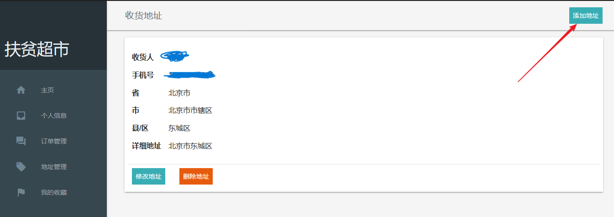
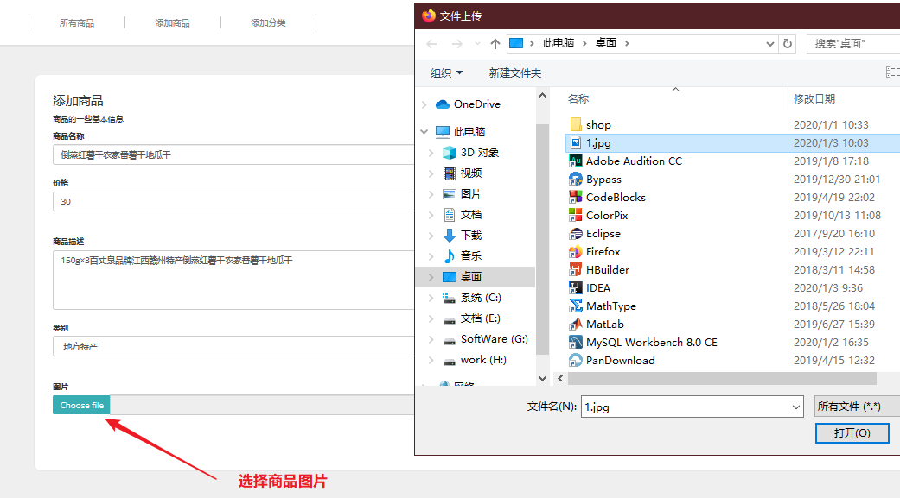

**《工程实训》报告**

| 学 院：    | 信息工程学院          |
|------------|-----------------------|
| 专业班级： | 计算机科学与技术162班 |
| 学 号：    | 20163289（21号）      |
| 姓 名：    | 谭敏                  |
| 指导老师： | 李淑芝                |
| 分 数：    |                       |
| 完成时间： | 2019年1月10日         |

# 目 录

[第一章 项目简介](#第一章-项目简介)

[1.1 项目背景](#_Toc29375883)

[1.2 主要功能](#_Toc29375884)

[1.3 使用语言以及开发工具](#_Toc29375885)

[1.4 使用技术](#_Toc29375886)

[1.5 分工情况](#_Toc29375890)

[第二章 设计的内容及要求](#第二章-设计的内容及要求)

[2.1 设计内容](#_Toc29375892)

[2.2 设计要求](#_Toc29375893)

[2.3 流通子系统用例图设计](#_Toc29375894)

[2.4 系统流通子系统类模型设计](#_Toc29375895)

[2.5 系统的业务处理模型设计](#_Toc29375896)

[第三章 总体设计](#第三章-总体设计)

[3.1项目架构](#_Toc29375898)

[3.2 目录结构说明](#_Toc29375901)

[3.3 功能模块划分](#_Toc29375905)

[第四章 详细设计](#第四章-详细设计)

[4.1 各模块设计分析](#_Toc29375910)

[4.2 类的定义与其所要实现的功能](#_Toc29375913)

[4.3 数据库设计](#_Toc29375916)

[第五章 系统实现及主要界面](#第五章-系统实现及主要界面)

[5.1 系统部署及使用说明](#_Toc29375918)

[5.2 运行效果](#_Toc29375919)

[总结](#_Toc29375922)

[附录 其他代码](#_Toc29375922)

# 第一章 项目简介

1.1 项目背景

在国家精准扶贫的号召下，江西理工大学帮扶兴国县、崇贤乡、崇义村在学校内开办“扶贫超市”，帮助贫困农户和其他村民的农特产品。既解决了贫困户的销售担忧，也满足了学校师生对生态农特产品的需求，更体现了老师的爱心消费观念，让老师与农户有了心与心的贴近。

应学校扶贫超市的邀请，制作了这一款提供给学校师生的购物平台——“扶贫超市”，该项目同时还配有后台管理功能，提供给超市管理者用于商品以及订单的管理。

1.2 主要功能

扶贫超市是一款基于SSM（Spring+SpringMVC+Mybatis）后台框架的购物管理系统，项目前端用户界面主要功能有：

（1）带有验证码的注册登录模块

（2）浏览分类商品

（3）收藏商品

（4）商品搜索

（5）加入购物车

（6）个人信息管理（包括个人密码、订单管理、地址管理、收藏管理等）

项目的后台管理员端主要有如下功能：

（1）用户管理

（2）商品管理

（3）订单管理

（4）活动管理

1.3 使用语言以及开发工具

后台：Java语言，使用软件IDEA进行开发，IDEA 全称 IntelliJ IDEA，是Java编程语言开发的集成环境。IntelliJ在业界被公认为最好的Java开发工具，尤其在智能代码助手、代码自动提示、重构、J2EE支持、各类版本工具(git、svn等)、Junit（单元测试）、代码分析等方面有着较好的支持。

前端：HTML+CSS，以及JavaScript脚本语言，使用软件HBuilder编写。HBuilder的最大优势是速度快，效率高。通过完整的语法提示和代码输入法、代码块等，大幅提升HTML、JS和CSS的开发效率。

1.4 使用技术

1.4.1 SSM框架

SSM框架的全称是Spring+SpringMVC+Mybatis，这是一款以Java语言为核心，涵盖了Web项目的容器、设计模式以及数据库映射的框架。

**（1）Spring**

Spring是于2003 年兴起的一个轻量级的Java 开发框架，有时也称它为一个容器由Rod Johnson 在其著作《Expert One-On-One J2EE Development and Design》中阐述的部分理念和原型衍生而来。它是为了解决企业应用开发的复杂性而创建的。

Spring使用基本的JavaBean来完成以前只可能由EJB完成的事情。然而，Spring的用途不仅限于服务器端的开发。从简单性、可测试性和松耦合的角度而言，任何Java应用都可以从Spring中受益。 简单来说，Spring是一个轻量级的控制反转和面向切面的容器框架。

**（2）SpringMVC**

Spring MVC属于SpringFrameWork的后续产品，已经融合在SpringWebFlow里面。Spring MVC 分离了控制器、模型对象、分派器以及处理程序对象的角色，这种分离让它们更容易进行定制。

**（3）Mybatis**

MyBatis本是Apache的一个开源项目IBatis，2010年，这个项目由Apache Software Foundation 迁移到了Google Code，并且改名为MyBatis 。MyBatis是一个基于Java的持久层框架。IBATIS提供的持久层框架包括SQL Maps和Data AccessObjects（DAO）。MyBatis 消除了几乎所有的JDBC代码和参数的手工设置以及结果集的检索。MyBatis 还使用简单的 XML或注解用于配置和原始映射，将接口和普通Java对象映射成数据库中的记录。

1.4.2 数据库

项目使用了MySQL数据库，这是一款开源免费且小型的关系型数据库，MySQL未必是功能最强大的数据库，但是因为其速度、可靠性和适应性却受到广大开发者的青睐。在不需要事务化处理的情况下，MySQL也是管理内容最好的选择。由于本项目只面向江西理工大学的师生提供超市物品的购买服务，因此使用MySQL数据库不失为一种好的选择。

1.4.3 Maven仓库

Maven是一个项目管理工具，提供了一个项目对象模型（POM）文件的新概念来管理项目的构建，相关性和文档。最强大的功能就是能够自动下载项目依赖库，省去了Web项目需要导入数量众多且版本不一的Jar包的麻烦。

只需在Maven官网http://maven.apache.org/download.cgi下载压缩包并安装、配置好环境变量即可使用，在IDEA创建项目时即需要勾选创建一个Maven-webapp项目，如图1-1所示。

图1-1 创建Maven-webapp项目

1.5 分工情况

本组共两名人员，其中组长1人谭敏，组员1人赵雪瑞，分别担任后台以及前端的工作，其完整分工如表1-1所示。

表1-1 小组分工

| **成员** | **职务** | **任务**                                              |
|----------|----------|-------------------------------------------------------|
| 谭敏     | 组长     | ①项目功能设计 ②后台项目配置 ③数据库设计 ④接口编写     |
| 赵雪瑞   | 组员     | ①项目功能设计 ②前端页面搭建 ③JS逻辑代码编写 ④UI、作图 |

# 第二章 设计的内容及要求

2.1 设计内容

本项目分别为浏览商品的用户与管理商品以及购物活动的商家提供了用户端与管理端，因此分别设计了如下功能：

（1）带有验证码的登录注册功能。

（2）浏览分类商品

（3）收藏商品

（4）商品搜索

（5）客服对话

（6）加入购物车

（7）用户个人信息设置

（8）用户管理

（9）商品管理

（10）订单管理

（11）活动管理

2.2 设计要求

利用四个周培训所学，开发一款前后端交互的综合Web项目，包括的功能有：登录注册功能、符合项目具体的功能的前端页面开发、后台包括逻辑交互路由逻辑编写、数据库设计与数据的增删改查等。

通过项目的开发，在实际过程中学习SSM框架各部分所起的作用，学会SSM框架的各项配置。

数据库使用MySQL，要求项目的功能设计数据库不能低于5个表，且功能完善、界面好看。

2.3 流通子系统用例图设计

**（1）系统用例模型主要元素**

参与者：用户（顾客）。

用例：注册、登录、浏览、搜索、购买、管理。

关联：参与者与注册、登录、浏览、搜索、购买、管理之间建立关联关系。

系统边界：扶贫超市系统流通子系统。

**（2）用例图**

扶贫超市系统流通子系统用例图如图2-1所示。

图2-1 扶贫超市系统流通子系统用例图

2.4 系统流通子系统类模型设计

由于整个系统涉及的类数目众多，因此这里只展示关于用户（顾客）以及订单的系统流通子系统类模型。用户类包括用户ID、用户名等基本信息，类方法包括获取全部订单的GetToatal等方法。用户下单后则向数据库添加一条物流记录，关于下单的流通子系统类模型设计如图2-2所示。

图2-2 系统流通子系统类模型设计

2.5 系统的业务处理模型设计

购物系统业务处理模型涉及的对象有用户（顾客）以及超市管理员，用户在主页可选中登录或是注册，再进入注册浏览商品。浏览商品时可选中进行分类浏览或者是在主页直接浏览，值得一提的是在主页进行商品的浏览也是根据类别排列的。

用户选中心仪的商品后可以加入购物车，并在购物车进行结算，此时会提示用户选择已有的收货地址，若是用户从未添加过地址，会跳转到个人中心页面，用户可在此页面添加一个新的收货地址。

用户提交订单后进行支付方式的选择并支付，后台数据库插入新订单的数据记录，此时后台超市管理员可在管理端收到订单的更新消息，并根据商品的信息以及库存情况进行发货，并及时准备商品的配送。

发货成功后，管理员必须及时更新订单情况，安排配送人员等，最后再确认订单的完成，再次更新订单状态，整个购物流程由此就结束。购物系统的业务处理模型设计如图2-3所示。

图2-3 购物系统的业务处理模型设计

# 第三章 总体设计

3.1项目架构

3.1.1 总体架构

项目主要分为用户端、管理端以及服务端，其中用户端主要有以下功能页面：带有验证码的登录注册功能、浏览分类商品、购买商品与用户个人信息设置。而管理端主要有用户管理、商品管理、订单管理、活动管理等功能。服务端使用SSM框架搭建，用于和用户端与管理端进行数据的交互。系统整体架构如图3-1所示。

图3-1 系统整体架构

3.1.2 服务端架构

服务器的SSM框架包括接口层、数据处理层、框架配置层。其中配置层主要进行数据库连接的管理、事务管理的配置、以及配置加载与缓存的处理；

数据处理层实际上是管理SpringMVC中各个Bean类中的模型与数据库中的映射工作，也叫参数映射，参数映射要做的工作分别有：参数映射配置、参数映射解析、以及参数类型的解析。而后是每个模型都有一个专门的Mapper.xml文件用于为各项事务编写对应的SQL语句，这也叫SQL映射，其中要做的工作分别有SQL获取、SQL解析以及动态SQL的解析。关于SQL映射与执行以及最后的结果映射涉及到的是Mybatis框架的语法，需要对其语法了解的足够深入才能编写出动态SQL以进行复杂业务的操作。

接口层是指后台代码中的各个Controller，其中最常见的应该是关于增删改查的接口，当然还包括一些视图函数用于控制前端的路由等。

服务端的具体架构如图3-2所示。

图3-2 服务端架构

3.2 目录结构说明

项目的目录结构分别对应着服务端SSM框架的整体结构以及前端文件的结构，主要包括后台Java代码目录以及前端资源文件webapp。后台Java代码目录有包括控制层、接口层、实体类、服务层文件，以及关于SSM框架所必需的配置扫描器、配置事务以及其他关于数据库连接以及数据库模型映射的mapper目录和几个xml配置文件。

整个扶贫超市系统项目的具体目录解释说明如图3-3所示。

图3-3 项目的目录结构

接下来将分文件夹、后台重要的Java目录、重要配置文件三部分分别讲解项目的整体目录结构组成与作用。

3.2.1 文件夹说明

**（1）src目录**

src为根目录，放置有main和test。

**（2）main目录**

main为主要目录，放置Java代码和一些资源文件。

**（3）Java目录**

Java存放后台Java代码，这个文件夹要使用Build Path -\> Use as Source Folder，使整个包结构一目了然，新建的包package就相当于在这里新建文件夹。

**（4）resources目录**

是maven的规范，用于存放资源文件，譬如各种的Spring、Mybatis和Log等配置文件。

**（5）mapper目录**

存放dao中每个方法对应的sql语句，在mapper文件中配置后，无需再写dao层（接口层）的实现类daoImpl类。

**（6）webapp目录**

存放前端的静态资源，如JSP、JS、CSS等。

**（7）WEB-INF目录**

WEB-INF是很重要的一个目录，外部浏览器无法访问，可以把JSP文件放在这里，另外就是web.xml配置文件，部署时基本上只有webapp里的会直接输出到根目录，其他都会放入WEB-INF目录，项目内部依然可以使用classpath:XXX来访问。

3.2.2 其他重要目录

**（1）Controller控制层**

Controller下的类主要用于规划访问路径（即进行前端页面的路由），如JSP页面中访问后台的接口一般都是Controller类中的注释进行指明。同时这些Controller类也用于接收从前台传输的数据，如进行登录的LoginController类的代码如下所示：

package com.toky.shop.controller.admin;

@Controller

@RequestMapping("/admin")

public class LoginController {

@Autowired

private AdminService adminService;

@RequestMapping("/login")

public String adminLogin() {

return "adminLogin";

}

@RequestMapping("/confirmLogin")

public String confirmLogin(Admin admin, Model model, HttpServletRequest request) {

Admin selectAdmin = adminService.selectByName(admin);

if (selectAdmin == null) {

model.addAttribute("errorMsg", "用户名或密码错误");

return "adminLogin";

} else {

HttpSession session = request.getSession();

session.setAttribute("admin", selectAdmin);

return "redirect:/admin/user/show";

}

}

}

上述代码中@RequestMapping注解中所注明的路径即前端访问的url路径。

**（2）Dao层**

Dao层也称为数据访问层，主要是做数据持久层的工作，负责与数据库进行交互的一些任务都封装在此，可以是数据库操作，也可以是文件读写操作，甚至是redis缓存操作。DAO层的设计首先是设计DAO的接口，然后就可在模块中调用此接口来进行数据业务的处理，而不用关心此接口的具体实现类是哪个类，显得结构非常清晰，Mybatis的机制使得Dao层下所有的接口都直接在配置文件中实现对应的方法，而无需像service一样再写impl实现类。

**（3）Service层**

Service层也叫业务逻辑（接口），主要负责业务模块的逻辑应用设计，Service层的业务实现，具体要调用到已定义的DAO层的接口，封装Service层的业务逻辑有利于通用的业务逻辑的独立性和重复利用性，程序显得非常简洁。每个Service对应一个实现类ServiceImpl实现业务接口，一般事务控制也是写在实现类里。

**（4）pojo实体类**

在本项目中实体类放置在pojo下，有时也用entity或是domain目录。实体类一般与数据库的表相对应，封装dao层取出来的数据为一个对象，一般只在dao层与service层之间传输。

3.2.3 重要配置文件

**（1）pom.xml文件**

pom.xml 也称为项目对象模型（POM），这是整个Maven系统的基本单元，是maven用来管理项目所需的依赖包的配置文件，如若需要导入MySQL数据库连接所需的驱动依赖，直接在pom.xml的\<dependencies\>节点中的添加下述语句即可，改动version 还可更换版本，如下所示：

\<!--MySQL驱动包，直接改动version 还可更换版本--\>  
\<dependency\>  
 \<groupId\>mysql\</groupId\>  
 \<artifactId\>mysql-connector-java\</artifactId\>  
 \<version\>8.0.11\</version\>  
\</dependency\>

**（2）applicationContext.xml文件**

applicationContext.xml文件主要进行扫描器、数据源、以及与MyBatis的整合配置。详细配置如下所示：

\<!--除了控制器都扫描，和SpringMVC相反--\>

\<context:component-scan base-package="com.toky.shop"\>

\<context:exclude-filter type="annotation" expression="org.springframework.stereotype.Controller"\>

\</context:exclude-filter\>

\</context:component-scan\>

\<!--Spring的配置文件，这里主要配置和业务逻辑有关的--\>

\<!--数据源，事务控制。--\>

\<context:property-placeholder location="classpath:dbconfig.properties"/\>

\<!--\<bean id="propertyConfigurer" class="org.springframework.beans.factory.config.PropertyPlaceholderConfigurer"\>

\<property name="location" value="classpath:dbconfig.properties"/\>

\</bean\>--\>

\<bean id="pooledDataSource" class="com.mchange.v2.c3p0.ComboPooledDataSource"\>

\<property name="jdbcUrl" value="\${jdbc.jdbcUrl}"\>\</property\>

\<property name="driverClass" value="\${jdbc.driverClass}"\>\</property\>

\<property name="user" value="\${jdbc.user}"\>\</property\>

\<property name="password" value="\${jdbc.password}"\>\</property\>

\</bean\>

\<!--配置扫描器，将MyBatis接口的实现加入到ioc容器中--\>

\<bean class="org.mybatis.spring.mapper.MapperScannerConfigurer"\>

\<!--扫描所有dao接口的实现，加入到ioc容器中--\>

\<property name="basePackage" value="com.toky.shop.dao"\>\</property\>

\</bean\>

\<!--Spring配置文件的核心点（数据源、与MyBatis的整合、事务控制--\>

\<!--事务控制的配置--\>

\<bean id="transactionManager" class="org.springframework.jdbc.datasource.DataSourceTransactionManager"\>

\<!--控制住数据源--\>

\<property name="dataSource" ref="pooledDataSource"\>\</property\>

\</bean\>

**（3）spring-mvc.xml**

spring-mvc.xml文件中可以配置扫描service包所有注解，@Service用于配置事务管理器，即把事务管理交由spring来完成。除此之外，还可配置基于注解的声明式事务，可以直接在方法上@Transaction。

\<!--SpringMVC的配置，包含网站跳转逻辑的控制配置--\>

\<context:component-scan base-package="com.toky" use-default-filters="false"\>

\<!--只扫描控制器--\>

\<context:include-filter type="annotation" expression="org.springframework.stereotype.Controller"\>\</context:include-filter\>

\</context:component-scan\>

\<!--配置视图解析器，方便页面返回--\>

\<bean class="org.springframework.web.servlet.view.InternalResourceViewResolver"\>

\<property name="prefix" value="/WEB-INF/views/"\>\</property\>

\<property name="suffix" value=".jsp"\>\</property\>

\</bean\>

\<!--两个标准配置--\>

\<!--将springmvc不能处理的请求交给tomcat--\>

\<!-- 文件上传配置 --\>

\<bean name="multipartResolver" class="org.springframework.web.multipart.commons.CommonsMultipartResolver"\>

\<!-- 默认编码 --\>

\<property name="defaultEncoding" value="UTF-8"/\>

\<!-- 上传文件大小限制为31M，31\*1024\*1024 --\>

\<property name="maxUploadSize" value="32505856"/\>

\<!-- 内存中的最大值 --\>

\<property name="maxInMemorySize" value="4096"/\>

\</bean\>

**（4）mybatis-config.xml**

该文件中主要配置了实体类所对应的包路径以及在分也是所引入的外部插件地址。

\<?xml version="1.0" encoding="utf-8" ?\>

\<!DOCTYPE configuration PUBLIC "-//mybatis.org//DTD Config 3.0//EN" "http://mybatis.org/dtd/mybatis-3-config.dtd"\>

\<configuration\>

\<settings\>

\<setting name="mapUnderscoreToCamelCase" value="true"/\>

\</settings\>

\<typeAliases\>

\<package name="com.toky.shop.pojo" /\>

\</typeAliases\>

\<!--分页插件--\>

\<plugins\>

\<plugin interceptor="com.github.pagehelper.PageInterceptor"/\>

\</plugins\>

\</configuration\>

**（5）web.xml文件**

在WEB-INF下还有web.xml文件，在该文件里需要做很重要的配置如加载spring容器、监听器配置等，具体内容如下：

\<web-app\>

\<display-name\>Archetype Created Web Application\</display-name\>

\<!--加载spring容器--\>

\<context-param\>

\<param-name\>contextConfigLocation\</param-name\>

\<param-value\>classpath:applicationContext.xml\</param-value\>

\</context-param\>

\<context-param\>

\<param-name\>log4jConfigLocation\</param-name\>

\<param-value\>classpath:log4j.properties\</param-value\>

\</context-param\>

\<!--配置解决中文乱码的filter--\>

\<filter\>

\<filter-name\>encodingFilter\</filter-name\>

\<filter-class\>org.springframework.web.filter.CharacterEncodingFilter\</filter-class\>

\<init-param\>

\<param-name\>encoding\</param-name\>

\<param-value\>UTF-8\</param-value\>

\</init-param\>

\</filter\>

\<!--监听器配置--\>

\<listener\>

\<listener-class\>org.springframework.web.context.ContextLoaderListener\</listener-class\>

\<!--前端控制器配置--\>

\<servlet\>

\<servlet-name\>dispatcherServlet\</servlet-name\>

\<servlet-class\>org.springframework.web.servlet.DispatcherServlet\</servlet-class\>

\<init-param\>

\<param-name\>contextConfigLocation\</param-name\>

\<param-value\>classpath:spring-mvc.xml\</param-value\>

\</init-param\>

\<load-on-startup\>1\</load-on-startup\>

\</servlet\>

\<servlet-mapping\>

\<servlet-name\>dispatcherServlet\</servlet-name\>

\<url-pattern\>/\</url-pattern\>

\</servlet-mapping\>

\</web-app\>

3.3 功能模块划分

理工扶贫超市购物平台系统的主要分为用户端、管理端和服务端，下面将分这三部分讲解更细的功能模块划分。

3.3.1 用户端功能模块划分

理工扶贫超市项目的用户端主要有注册登录功能、浏览商品功能、购买商品以及个人信息管理功能。具体如图3-4所示。

图3-4 用户端功能模块划分

在登录模块带有验证码功能，以验证请求的真实性。此处需设计两个页面。

在用户进行登录验证后成功进入主页（main.jsp）进行商品的浏览，主页还设置了商品的分类浏览以及根据商品名模糊查询想要购买的商品等功能，使购物系统更贴近用户的需求。

购买商品主要分为以下几个功能模块：查看商品详情、选择是否收藏该商品，满意商品则可以加入购物车，而后添加收货地址、选择支付方式结算，最后提交订单即可完成商品的购买。

在个人信息管理模块，用户可进行基本信息与密码的修改，同时也可进行订单的查看与管理、收货地址的管理以及查看全部已收藏商品。

3.3.2 管理端功能模块划分

理工扶贫超市项目的管理端主要有登录注册、用户管理（进行用户的查看与删除功能）、活动管理、订单管理、商品管理等功能。

在商品管理页，管理员可添加商品与商品的分类。在订单管理页面，管理员可查看所有未发货订单，并可修改订单的状态。

此外，每个商品还可添加促销活动，活动管理页面可以进行活动的添加与删除等功能。具体如图3-5 所示。

图3-5 管理端功能模块

3.3.2 服务端功能模块划分

理工扶贫超市项目的服务端主要设置了一系列数据库的基本表，其二是服务端为了满足用户端与管理端的各项基本功能所进行的逻辑交互，如图3-6所示。

图3-6 服务端功能模块划分

# 第四章 详细设计

4.1 各模块设计分析

4.1.1 用户端模块设计分析

用户端涉及登录与注册、商品的浏览与购买、个人信息管理等功能，其中，登录与注册需设计两个页面，涉及数据包括手机号码、用户名、密码等，还需要进行验证码功能的完善。

浏览商品模块可放置在在主页的轮播图片下进行商品的展示，最好进行瀑布流式布局展示商品，更加直观并且吸引用户购买。另外设置有分类浏览以及根据分类排序更加一目了然，且结合左上角的模糊查询搜索框基本可满足用户寻找商品的需求。

分类模块可以放置在主页的左上角，可以通过鼠标移动到某个大分类继而弹出小分类。所有分类最好以列表的形式呈现，给人一目了然的感觉。

浏览商品时还可以进行收藏，具体的交互课可以通过鼠标放置在商品图片上弹出心形按钮进行收藏。浏览商品功能模块涉及的全部数据包括商品名、图片、价格等。

购买功能模块共需要设计三个页面，分别是商品详情页面、加入购物车页面以及确认订单页面。其中，商品详情页面需要增加购物平台都有的商品图片的放大效果，以及展示商品其他信息，如描述、商品评价等。

在确认订单页面，重要的信息有用户的收货地址，可以显示用户所有的地址，最后使用单选框组件提示用户进行选择，同样需要选择的还有支付方式。

在个人信息管理模块，可以使用左侧菜单栏的页面设计，这在Bootstrap框架中很容易引入，总共需要设计四个页面，分别是信息与密码修改页面、订单管理页面、地址管理页面以及我的收藏页面。关于修改信息的交互全部设计成弹出弹框，而无需再开启一个页面。

上述所有关于用户端功能模块的设计如表4-1所示。

表4-1 用户端模块设计分析

| **面向群体** | **功能模块** | **页面交互设计**               | **涉及数据以及详细设计**                               |                                            |
|--------------|--------------|--------------------------------|--------------------------------------------------------|--------------------------------------------|
| 用户端       | 登录注册     | 注册页面                       | 手机号码用户名、密码                                   |                                            |
|              |              | 登录页面                       | 输入用户名密码、验证码                                 |                                            |
|              |  浏览商品    | 在主页的轮播图片下进行商品展示 | 瀑布流式布局展示商品， 涉及商品名、图片、价格等        |                                            |
|              |              | 分类模块放置在主页的左上角     | 可以通过鼠标移动到某个 大分类继而弹出小分类            |                                            |
|              |              | 收藏商品                       | 可通过鼠标放置在商品图片 上弹出心形按钮进行收藏        |                                            |
|              | 购买商品     | 商品详情页面                   | 商品图片的放大效果、商品其他 信息、描述、商品评价等    |                                            |
|              |              |                                | 收藏商品                                               |                                            |
|              |              | 加入购物车页面                 | 购物车列表增加一条记录                                 |                                            |
|              |              | 确认订单页面                   | 选择收货地址单选框                                     | 若无收货地址，跳转到个人信息页提示用户添加 |
|              |              |                                | 选择支付方式单选框                                     | 在线支付/货到付款                          |
|              | 个人信息管理 | 信息与密码修改页面             | 修改信息的交互全部设计成弹出弹框，而无需再开启一个页面 |                                            |
|              |              | 订单管理页面                   | 未发货/未收货/已完成                                   |                                            |
|              |              | 地址管理页面                   | 查看/修改/删除收货地址                                 |                                            |
|              |              | 我的收藏页面                   | 查看/删除                                              |                                            |

4.1.2 管理端模块设计分析

管理端设计有登录、用户管理、活动管理、订单管理、商品管理等模块，且管理员端全部页面都使用了左侧菜单方式呈现，在多条数据页面通通采取分页形式展现。其中，由于管理员人数较少，未设计注册功能，管理员可利用账号、密码进行登录，且由于时间紧迫也为设计管理员的权限管理功能。

在用户管理模块，管理员可以查看与删除用户。在活动管理页面，管理员可以查看所有活动并且可以进行活动的添加。在订单管理页面，管理员可以根据用户Id进行查看所有未发货/未收货/已完成订单。

在商品管理模块，供设计有三个页面，分别是所有商品展示页、添加商品页与添加分类页。管理员可以所有商品页进行商品的编辑或者删除。

以上全部功能设计如表4-2所示。

表4-2 管理端模块设计

| **面向群体** | **功能模块** | **页面设计**                         | **涉及数据以及详细设计**                           |
|--------------|--------------|--------------------------------------|----------------------------------------------------|
| 管理端       | 登录         | 由于管理员人数较少，可不设计注册功能 | 管理员账号、密码                                   |
|              | 用户管理     | 查看用户页面                         | 用户名、邮箱、电话                                 |
|              |              | 删除用户页面                         | 暂未设计管理员权限                                 |
|              | 活动管理     | 查看所有活动页面                     | 活动名、折扣、满减 金额、活动描述                  |
|              |              | 添加活动页面                         | 活动名、折扣、满减 金额、活动描述                  |
|              | 订单管理     | 订单管理页面                         | 根据用户Id进行查看， 未发货/未收货/已完成          |
|              | 商品管理     | 所有商品页                           | 显示商品信息，进行编辑或者删除                     |
|              |              | 添加商品页                           | 商品名、价格、数量、描述、类别、详细类别、上传图片 |
|              |              | 添加分类页                           | 编辑已有分类、添加分类                             |

4.2 类的定义与其所要实现的功能

4.2.1 Controller类

Controller下的类主要用于规划访问路径的（即进行前端页面的路由），如JSP页面中访问后台的接口一般都是Controller类中的注释进行指明。同时这些Controller类也是用来接收从前台传输的数据的。

**（1）管理员端**

管理员端一共有5个Controller类，分别是UserController、ActivityController、AdminOrderController、GoodsController和LoginController，分别负责项目对应着管理端的用户管理、活动管理、商品管理、管理员的登录等功能，其最外层URL以/admin/开头，下层URL分别对应着几大功能，最底层URL又对应着具体的操作，如展示的/show、增加数据/add等，具体如表4-3所示。

表4-3 管理员端所有Controller类

| **面向群体**  | **controller**       | **包含url**     | **下级url**       | **实现功能**           |
|---------------|----------------------|-----------------|-------------------|------------------------|
| 管 理 员admin | UserController       | /admin/user     | /show             | 默认展示页             |
|               |                      |                 | /showjson         | 分页接口               |
|               | ActivityController   | /admin/activity | /show             | 管理员查看所有活动     |
|               |                      |                 | /add              | 添加活动               |
|               |                      |                 | /addResult        | 添加是否成功           |
|               |                      |                 | /update           | 更新活动               |
|               |                      |                 | /delete           | 删除活动               |
|               | AdminOrderController | /admin/order    | /send             | 默认显示已派送的订单   |
|               |                      |                 | /sendGoods        | 点击订单页面的发货按钮 |
|               |                      |                 | /complete         | 已完成订单             |
|               |                      |                 | /receiver         | 未收货订单             |
|               | GoodsController      | /admin/goods    | /showjson         | 默认展示所有货物       |
|               |                      |                 | /add              | 添加                   |
|               |                      |                 | /update           | 修改商品信息           |
|               |                      |                 | /delete/{goodsid} | 删除                   |
|               |                      |                 | /addCategory      | 添加分类               |
|               |                      |                 | /deleteCate       | 删除分类               |
|               |                      |                 | /saveCate         | 修改分类               |
|               | LoginController      | /admin          | /login            | 登录系统               |
|               |                      |                 | /logout           | 退出系统               |

**（2）用户端**

用户端一共有6个Controller类，分别实现顾客用户端各项功能，具体如表4-4所示。

表4-4 用户端所有Controller类

| **面向群体** | **controller**                 | **包含url**           | **实现功能**       |
|--------------|--------------------------------|-----------------------|--------------------|
| 顾客         | CartController                 | /addCart              |                    |
|              |                                | /showcart             | 展示购物车         |
|              |                                | /deleteCart/{goodsid} | 删除购物车商品     |
|              | CustomerController             | /login                | 登录               |
|              |                                | /loginconfirm         | 登录验证           |
|              |                                | /register             | 注册               |
|              |                                | /information          | 个人信息页         |
|              |                                | /info/address         | 收货地址管理       |
|              |                                | /saveAddr             | 修改地址后保存     |
|              |                                | /deleteAddr           | 删除地址           |
|              |                                | /insertAddr           | 新增地址           |
|              |                                | /info/list            | 个人信息中我的订单 |
|              |                                | /deleteList           | 删除订单           |
|              |                                | /info/favorite        | 我的收藏           |
|              |                                | /savePsw              | 修改密码后保存     |
|              |                                | /finishList           | 点击完成订单按钮   |
|              |                                | /logout               | 退出系统           |
|              | FrontGoodsController           | /detail               | 商品详情页         |
|              |                                | /search               | 搜索商品、模糊查询 |
|              |                                | /collect              | 收藏按钮           |
|              |                                | /deleteCollect        | 取消收藏           |
|              |                                | /category             | 点击完成订单按钮   |
|              |                                | /comment              | 评论功能           |
|              | MainController                 | /main                 | 主页               |
|              | OrderController                | /order                | 订单页             |
|              |                                | /orderFinish          | 确认订单           |
|              | Verification CodeImgController | /verificationcodeimg  | 验证码功能         |

4.2.2 其他类定义

项目架构中其他层还包括如下类：dao类、poji实体类、Service类、Service的实现类Service-Impl。

Dao层负责与数据库进行交互的一些任务都封装在此，可以是数据库操作、也可以是文件读写操作，甚至是redis缓存操作。Service层主要负责业务模块的逻辑应用设计，Service层的业务实现，具体要调用到已定义的DAO层的接口，

实体类一般与数据库的表相对应，封装dao层取出来的数据为一个对象，一般只在dao层与Service层之间传输。其具体说明如表4-5所示。

表4-5 项目中其他类定义

| **dao类**       | **poji实体类** | **Service类**   | **Service实现类** | **说明**     |
|-----------------|----------------|-----------------|-------------------|--------------|
| ActivityMapper  | Activity       | ActivityService | ActivityImpl      | 活动相关     |
| AddressMapper   | Address        | AddressService  | AddressImpl       | 收货地址相关 |
| AdminMapper     | Admin          | AdminService    | AdminImpl         | 管理员       |
| CategoryMapper  | Category       | CateService     | CateImpl          | 分类         |
| CommentMapper   | Comment        | CommentService  | CommentImpl       | 评论相关     |
| DeliverMapper   | Deliver        |                 |                   | 配送         |
| FavoriteMapper  | Favorite       | OrderService    | OrderImpl         | 收藏         |
| GoodsMapper     | Goods          | GoodsService    | GoodsImpl         | 商品         |
| ImagePathMapper | ImagePath      |                 |                   | 商品图片地址 |
| OrderItemMapper | OrderItem      |                 |                   | 订单中商品项 |
| OrderMapper     | Order          |                 |                   | 订单         |
| ShopCartMapper  | ShopCart       | ShopCartService | ShopCartImpl      | 购物车       |
| UserMapper      | User           | UserService     | UserImpl          | 用户         |

4.3 数据库设计

数据库设计算得上是Web项目的核心，为贴合项目的各项需求，如用户端顾客的各种行为，以及管理端管理员所进行的几大管理功能，重点是添加商品和分类功能，团队进行了如图4-1所示的数据库设计。在图4-1中主要包括有用户表（user）、商品表（goods）、分类表（category）、订单表（indent）、收藏表（collection）、订单项表（orderitem）等。详细的数据库实体关系ER图如图4-1所示。

图4-1 数据库ER图

其中涉及主要功能模块的表详细字段如下所示：

（1）用户表user

该表用于存储用户的基本信息。包括：userId（主键）、邮箱email、注册时间regTime、电话号码telephone。

（2）商品表goods

goodsId（主键）、分类category（外键）、goodsName、price、商品数量num、创建时间upTime、description、详细分类detailCate、活动activityId（外键）。

（3）分类表category

cateId（主键）、cateName。

（4）订单表indent

orderId（主键）、userId（外键）、addressId（外键）、orderTime、原始价格oldPrice、折扣价格newPrice、isPay、isSend、isReceive、isComplete。

（5）收藏表collection

userId（主键），goodsId（主键）、收藏时间collectTime。

（6）订单项表orderitem

itemId（主键）、orderId（外键）、goodsId（外键）、商品数量num。

# 第五章 系统实现及主要界面

5.1 系统部署及使用说明

项目的GitHub源码地址：https://github.com/Tokymin/shop_ssm，目前系统已部署到服务器上，体验链接http://103.113.158.123:8080/shop/，管理者体验账号账户名：admin 密码：123456。

值得注意的是，若是本机部署需在IDEA上配置商品图片的虚拟路径，Tomcat服务器储存图片的真实地址"G:\\Projects\\imageSources\\"，如图5-1所示。

图5-1商品图片储存真实地址

在浏览器打开调试模式可看到访问图片的url是/dataResourceImages，如图5-2所示。

图5-2 图片访问虚拟路径url

这些配置需要修改Tomcat的server.xml文件，在该文件Host节点下添加如下配置代码：

\<!--path是虚拟路径，docBase为真实路径 --\>

\<Context path="/dataResourceImages" docBase="G:\\Projects\\imageSources" crossContext="true" reloadable="false" debug="0"/\>

项目运行后用户登录主页的地址直接是http://localhost:8080/login，管理端的登录地址是http://localhost:8080/admin/login。

5.2 运行效果

5.2.1 用户端运行效果

**（1）注册与登录**

首先，用户需要在注册页面填写相关信息进行账号的注册，要填写的信息有用户名、密码、邮箱、电话，注册成功后跳转到登录页面进行登录操作。

具体运行示意图如图5-3所示。

（a）填写信息注册

（b）填写正确的账号密码、验证码登录

图5-3 注册与登录

**（2）浏览商品**

成功登录进入主页后，可以看到以瀑布流形式呈现的所有商品预览图等信息，且商品也是按类别排列的。如图5-4所示。

除此之外，用户还可以在左上角选择更细致的分类，进行检索，这时会出现该分类下所有商品的信息。如图5-5所示。

图5-4 主页浏览商品

图5-5 选择分类

此时会在新页面显示当前更细分类下所有商品，如图5-6所示。

图5-6 分类结果

用户还可以在主页的右上角搜索框进行商品的模糊查询，该模糊查询可精确到单个字符，如图5-7所示。

（a）输入关键字搜索

（b）搜索结果

图5-7 搜索功能

点击某一商品的预览图可以进入商品详情页，可在该页面查看到商品的放大图片，以及价格等其他信息。如图5-8所示。

图5-8 商品详情页

加入购物车之后可以在购物车页面看到刚才添加的商品，点击商品签到“x”叉号可以删除购物车中的商品，如图5-9所示。

图5-9 购物车页面

若用户对当前添加入购物车的商品满意，可以点击图5-9所示的购物车页面中的确认订单按钮，这时可以直接选中已有的收货地址， 选择支付方式并结算。进入确认订单页面，如图5-10所示。

图5-10 添加收货地址并确认订单

若无收货地址，则会进入用户的个人信息页面进行添加，用户点击右上角蓝色按钮即可添加新地址，而在已有的地址条目里还可以进行修改和删除，如图5-11所示。

图5-11 添加地址

可在个人中心页面看到所有订单情况，如图5-12 所示。

图5-12 个人管理之订货管理页面

5.2.2 管理端运行效果

**（1）登录**

由于管理员人数较少，故没有设计注册功能，管理者只需登录开发者提供的账号进行登录即可，如图5-13所示。

图5-13 管理员登录

**（2）用户管理**

管理者可点击左侧菜单选择对应项进行用户的管理，如图5-14所示。

图5-14用户管理

**（3）商品管理**

在商品管理员可以分页进行所有商品的查看，如图5-15所示。

图5-15商品管理

在添加商品页面，除了填写商品的基本信息以外，还需要上传一张商品的展示图片，如图5-16所示。

（a）填写商品信息

（b）添加成功

图5-16添加商品

**4. 订单管理**

管理者可进行所有订单的查看，分3类，分别是未发货、未收货和已完成订单，订单的展示是根据用户来展示的。如图5-17所示。

图5-17订单管理

**5. 活动管理**

管理端的活动管理页面十分简单，只设计了活动的查看与删除功能，如图5-18所示。

图5-18活动管理

# 总结

通过这四个周的学习，我更深入的学习了SSM框架的特点，也更好的理解了前后端开发的概念，在和团队成员合作开发的过程中，我还学会了利用git进行版本控制，并了解了项目的几种开发环境等等，收获颇丰。

在设计项目过程中，我与团队成员分工合作，我负责总体功能的设计以及数据库的设计，队友负责前端的页面设计，并且也参考了千峰老师所教的知识以及源码，并在此基础上不断进行完善与改进，成功完成该扶贫超市系统的开发。我希望日后项目能真正投入使用，后续的维护工作将会交给下一届工作室成员。

在编写代码的过程中遇到了一系列bug，例如在做收藏功能时发现总是不能返回一个集合，最终向老师请教才知道是没有在模型里写对模型的关系，才导致只能返回一条数据。

在项目部署到服务器的过程中也遇到了一系列问题，如Nginx、uwsgi配置端口的问题，还有关于Tomcat服务器存储图片的虚拟环境配置问题，最终请教了学长以及其他更熟悉后台开发的同学才得以解决。

由于技术有限，项目的有些功能还不是特别完善，例如客服消息、支付等还不能成功的实现，另外在运行过程中也还发现了一些小问题，这些都将在日后继续完善并解决。

在老师的指导下，关于文档、报告的格式方面我也有了进一步的收获，希望在日后的论文写作过程中能少犯一些低级错误，继续提升自己的能力。

# 附录 其他代码

package com.toky.shop.controller.front;

@Controller

public class MainController {

@Autowired

private CateService cateService;

@Autowired

private GoodsService goodsService;

@RequestMapping("/main")

public String showAllGoods(Model model, HttpSession session) {

Integer userid;

User user = (User) session.getAttribute("user");

if (user == null) {

userid = null;

} else {

userid = user.getUserid();

}

List\<Goods\> digGoods = getCateGoods("蔬菜类", userid);

model.addAttribute("digGoods", digGoods);

List\<Goods\> manuGoods = getCateGoods("手工类", userid);

model.addAttribute("manuGoods", manuGoods);

List\<Goods\> houseGoods = getCateGoods("水果类", userid);

model.addAttribute("houseGoods", houseGoods);

List\<Goods\> colGoods = getCateGoods("农家系列", userid);

model.addAttribute("colGoods", colGoods);

List\<Goods\> bookGoods = getCateGoods("家禽蛋类", userid);

model.addAttribute("bookGoods", bookGoods);

List\<Goods\> localGoods = getCateGoods("地方特产", userid);

model.addAttribute("localGoods", localGoods);

List\<Goods\> otherGoods = getCateGoods("其他", userid);

model.addAttribute("otherGoods", otherGoods);

return "main";

}

public List\<Goods\> getCateGoods(String cate, Integer userid) {

//查询分类

CategoryExample digCategoryExample = new CategoryExample();

digCategoryExample.or().andCatenameLike(cate);

List\<Category\> digCategoryList = cateService.selectByExample(digCategoryExample);

if (digCategoryList.size() == 0) {

return null;

}

//查询属于刚查到的分类的商品

GoodsExample digGoodsExample = new GoodsExample();

List\<Integer\> digCateId = new ArrayList\<Integer\>();

for (Category tmp:digCategoryList) {

digCateId.add(tmp.getCateid());

}

digGoodsExample.or().andCategoryIn(digCateId);

List\<Goods\> goodsList = goodsService.selectByExampleLimit(digGoodsExample);

List\<Goods\> goodsAndImage = new ArrayList\<Goods\>();

//获取每个商品的图片

for (Goods goods:goodsList) {

//判断是否为登录状态

if (userid == null) {

goods.setFav(false);

} else {

Favorite favorite = goodsService.selectFavByKey(new FavoriteKey(userid, goods.getGoodsid()));

if (favorite == null) {

goods.setFav(false);

} else {

goods.setFav(true);

}

}

List\<ImagePath\> imagePathList = goodsService.findImagePath(goods.getGoodsid());

System.out.println(imagePathList);

goods.setImagePaths(imagePathList);

goodsAndImage.add(goods);

}

return goodsAndImage;

}

}

package com.toky.shop.controller.front;

@Controller

public class FrontGoodsController {

@Autowired

private GoodsService goodsService;

@Autowired

private CateService cateService;

@Autowired

private CommentService commentService;

@Autowired

private UserService userService;

@Autowired

private ActivityService activityService;

@RequestMapping(value = "/detail",method = RequestMethod.GET)

public String detailGoods(Integer goodsid, Model model, HttpSession session) {

if(goodsid == null) {

return "redirect:/main";

}

User user = (User) session.getAttribute("user");

//要传回的数据存在HashMap中

Map\<String,Object\> goodsInfo = new HashMap\<String,Object\>();

//查询商品的基本信息

Goods goods = goodsService.selectById(goodsid);

if (user == null) {

goods.setFav(false);

} else {

Favorite favorite = goodsService.selectFavByKey(new FavoriteKey(user.getUserid(), goodsid));

if (favorite == null) {

goods.setFav(false);

} else {

goods.setFav(true);

}

}

//查询商品类别

Category category = cateService.selectById(goods.getCategory());

//商品图片

List\<ImagePath\> imagePath = goodsService.findImagePath(goodsid);

//商品评论

//商品折扣信息

Activity activity = activityService.selectByKey(goods.getActivityid());

goods.setActivity(activity);

//返回数据

goodsInfo.put("goods", goods);

goodsInfo.put("cate", category);

goodsInfo.put("image", imagePath);

model.addAttribute("goodsInfo",goodsInfo);

//评论信息

CommentExample commentExample=new CommentExample();

commentExample.or().andGoodsidEqualTo(goods.getGoodsid());

List\<Comment\> commentList=commentService.selectByExample(commentExample);

for (Integer i=0;i\<commentList.size();i++)

{

Comment comment=commentList.get(i);

User commentUser=userService.selectByPrimaryKey(comment.getUserid());

comment.setUserName(commentUser.getUsername());

commentList.set(i,comment);

}

model.addAttribute("commentList",commentList);

return "detail";

}

@RequestMapping(value = "/search", method = RequestMethod.GET)

public String searchGoods(@RequestParam(value = "page",defaultValue = "1") Integer pn, String keyword, Model model, HttpSession session) {

User user = (User) session.getAttribute("user");

//一页显示几个数据

PageHelper.startPage(pn, 16);

//查询数据

GoodsExample goodsExample = new GoodsExample();

goodsExample.or().andGoodsnameLike("%" + keyword + "%");

List\<Goods\> goodsList = goodsService.selectByExample(goodsExample);

//获取图片地址

for (int i = 0; i \< goodsList.size(); i++) {

Goods goods = goodsList.get(i);

List\<ImagePath\> imagePathList = goodsService.findImagePath(goods.getGoodsid());

goods.setImagePaths(imagePathList);

if (user == null) {//判断是否收藏

goods.setFav(false);

} else {

Favorite favorite = goodsService.selectFavByKey(new FavoriteKey(user.getUserid(), goods.getGoodsid()));

if (favorite == null) {

goods.setFav(false);

} else {

goods.setFav(true);

}

}

goodsList.set(i, goods);

}

//显示几个页号

PageInfo page = new PageInfo(goodsList,5);

model.addAttribute("pageInfo", page);

model.addAttribute("keyword", keyword);

return "search";

}

@RequestMapping("/collect")

@ResponseBody

public Msg collectGoods(Integer goodsid, HttpSession session) {

//取登录用户信息,未登录重定向至登录页面

User user = (User) session.getAttribute("user");

if(user == null) {

return Msg.fail("收藏失败");

}

Favorite favorite = new Favorite();//添加收藏

favorite.setCollecttime(new Date());

favorite.setGoodsid(goodsid);

favorite.setUserid(user.getUserid());

goodsService.addFavorite(favorite);

return Msg.success("收藏成功");

}

@RequestMapping("/deleteCollect")

@ResponseBody

public Msg deleteFavGoods(Integer goodsid, HttpSession session) {

User user = (User) session.getAttribute("user");

if (user == null) {

return Msg.fail("取消收藏失败");

}

//删除收藏

goodsService.deleteFavByKey(new FavoriteKey(user.getUserid(),goodsid));

return Msg.success("取消收藏成功");

}

@RequestMapping("/category")

public String getCateGoods(String cate, @RequestParam(value = "page",defaultValue = "1") Integer pn, Model model, HttpSession session) {

User user = (User) session.getAttribute("user");

//一页显示几个数据

PageHelper.startPage(pn, 16);

//查询分类id

CategoryExample categoryExample = new CategoryExample();

categoryExample.or().andCatenameLike(cate);

List\<Category\> categoryList = cateService.selectByExample(categoryExample);

//获取查出的类别id
